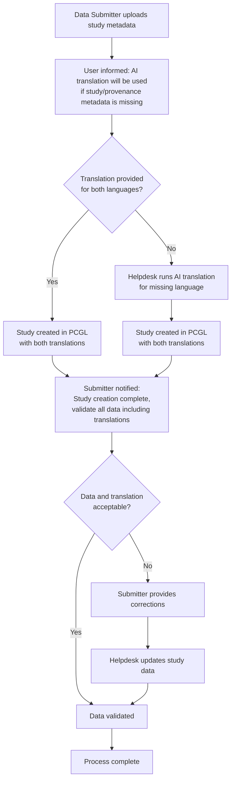

# Localization Strategy for Research Portal and DACO

## Background

The Research Portal and DACO portal will both be bilingual (English/French). However, the current data model does not include localization. This creates a user experience issue: when viewing the Research Portal in French, the interface would be in French but the data catalogue entries would remain in English, creating an inconsistent experience.

## The Problem

Someone or something needs to translate at least the provenance portion of the metadata (study-level information). The key questions were:
- What data model fields require translation?
- Who should be responsible for providing translations?
- Should data submitters be involved?
- How do we handle projects that lack capacity for translation?
- Should translations be vetted by humans?

## Decision (as of 2026-02-07)

### Primary Approach

**Option for Dual-Language Submission:**
- Data submitters will be given the option to upload descriptions in both English and French during the submission process
- Submitters will be informed upfront that AI translation will be used for any missing study/provenance metadata in supported languages

### Translation Workflow

**For missing translations:**
1. AI translation will be generated by the Helpdesk team when a translation for one of the supported languages is missing
2. The translation quality of modern AI systems is considered sufficient without extensive human vetting
3. Submitters will be responsible for validating all study data, including translations, once the study has been created in PCGL

### Workflow Diagram

### Support Resources

**Helpdesk involvement:**
- Helpdesk will run translation of provenance/study-level metadata for a language when it's missing

### Technical Implementation

The data model will need to be updated to include fields for localized content, allowing storage of both English and French versions of metadata.
Data model fields that have a predefined list of options need to be updated to include both French and English options.

## Rationale

- Modern AI translation systems are considered accurate enough for this use case
- Requiring submitters to provide translations could be burdensome for smaller projects
- Giving submitters the option balances quality with practicality
- Helpdesk-managed translation ensures all content is available in both languages
- Light touch verification process keeps overhead manageable while maintaining quality
