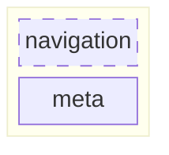

# Footer

## Overview

The PCGL Footer identity, documentation, definition and properties are based on the [Canada design system](https://design-system.canada.ca/en/components/footer/) and the [Canadian Institutes
of Health Research visual identity](https://cihr-irsc.gc.ca/e/50426.html).

## Properties

| Property            | Attribute            | Description| Type| Default     |
| ------------------- | -------------------- | ---------- | --- | ----------- |
| [meta](/patterns/molecules_regions/footer-meta-item.schema.json) | `meta` | Object containing the items for sub-footer. | `object`              | `{terms_conditions, logo}` |
| [navigation_sections](/patterns/atoms_components/navigation.schema)  | `navigation`   | Slot for displaying a band with lists of link items. Format: { render_title, render_links } | `object`    | `undefined` |

## Slots

[**navigation_sections**](/patterns/atoms_components/navigation.schema): Accepts a function to display contextual and external navigation items.

### Diagram

> Check out the [template](/patterns/templates/figma.md).