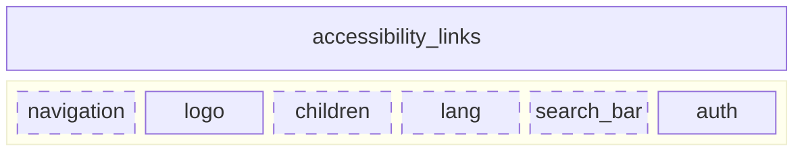

# Header

## Overview

The PCGL Header identity, documentation, definition, and properties are based on the [Canada design system](https://design-system.canada.ca/en/components/header/code/#section-essential) and the [DACO portal visual identity](https://www.figma.com/design/DMs06XLL2oAlCQlRktXYqA/PCGL-Design-Mockups---REBRAND--Copy-?node-id=2025-565&t=lLoqA9iHKkFA7Qb2-0).

## Properties

| Property            | Attribute            | Description| Type| Default     |
| ------------------- | -------------------- | ---------- | --- | ----------- |
| [accessibility_links](/patterns/atoms_components/link.schema.json) | `a11y-links` | Object containing hidden skip links for navigation accessibility. | `object`              | `{ url, children }` |
| [menu_options](/patterns/atoms_components/navigation.schema.json) | `render-menu` | Slot containing the items for navigation. | `object`              | `undefined` |
| [logo](/patterns/atoms_components/avatar.schema.json) | `logo` | Object containing the wordmark as an image wrapped inside an anchor or link. | `object`| `{ src, alt, width, height }` |
| [lang](/patterns/atoms_components/link.schema.json)  | `render_lang`   | Slot for switching between available language versions. | `object`    | `undefined` |
| **search_bar**  | `render_search` | Slot for displaying a search bar. | `object`    | `undefined` |
| [auth](/patterns/atoms_components/link.schema.json)  | `render_auth`   | Slot for displaying the authentication component. | `object`    | `undefined` |

## Slots

[**render-menu**](/patterns/atoms_components/navigation.schema.json): Accepts a function to display contextual and external navigation items, such a hamburger menu for example.

**`render_lang`**: Accepts a function to display the language toggle component.	

**`render_search`**: Accepts a function to display the search component.

**`render_auth`**: Accepts a function to display the authentication component.

### Diagram

> Check out the [template](/patterns/templates/figma.md).