# PCGL User Personas and Context

This document outlines the user personas, their actions (verbs), and their relationships with the system elements within the Pan-Canadian Genome Library (PCGL) platform.

## System Context Diagram

```mermaid
C4Context
    title PCGL Platform - User Personas and Context Diagram

    Enterprise_Boundary(pcgl, "Pan-Canadian Genome Library (PCGL)") {
        System(admin_tools, "Administration & Identity", "COManage, OIDC, System Config")
        System(submission_sys, "Data Submission System", "Score CLI, Song manifests, Schema validation")
        System(daco_portal, "DACO Portal", "Data Access Committee operations and applications")
        System(research_portal, "Research Portal", "Data discovery and access")
        System(tre, "TRE (Trusted Research Environment)", "Secure data analysis environment")
        System(participant_portal, "Participant Portal", "PHI isolated, consent management")
        System(reporting_module, "Reporting Module", "Compliance, QC, milestones")
        System(infrastructure, "SD4H Infrastructure", "K8s, Globus, S3, Pipelines")
    }

    %% Personas - Administrative & Support
    Person(super_admin, "Super-Admin", "Highest privilege group.")
    Person(data_admin, "Data Admin", "Manages data-related administrative operations.")
    Person(op_support, "Operational Support", "Assists data submitters with onboarding and setup.")
    Person(devops, "DevOps & Infrastructure", "Manages SD4H Kubernetes clusters, monitoring, backups.")

    %% Personas - Data Submission & Research
    Person(submitter, "Data Submitter", "Submits clinical and/or genomic data to a specific study.")
    Person(researcher, "Researcher", "Discovers data and requests access.")
    Person(daco_collaborator, "DACO Collaborator", "Project members wanting controlled data access.")
    Person(signing_official, "Signing Official", "Legally commits entity to data access agreements.")

    %% Personas - Governance
    Person(dac_chair, "DAC Chair", "Issues final approval or rejection of data access requests.")
    Person(dac_member, "DAC Member", "Views and reviews submitted data access applications.")
    Person(daco_admin, "DACO Admin", "Admin of the PCGL DACO Portal.")

    %% Personas - Other
    Person(participant, "Study Participant", "Interacts with the Participant Portal.")
    Person(funder, "Funding Body Rep", "Views compliance reports and project milestones.")

    System_Ext(external_platforms, "External Platforms", "gnomAD, Cloud Analysis (GA4GH APIs)")

    %% Relationships - Administrative
    Rel(super_admin, admin_tools, "Manages groups, OIDC, config, roles")
    Rel(data_admin, admin_tools, "Registers studies, schemas, assigns submitters")
    Rel(data_admin, submission_sys, "Flags submissions as validated, configures settings")
    Rel(op_support, submission_sys, "Creates studies, registers participants, wrangles data, submits on behalf")
    Rel(devops, infrastructure, "Manages clusters, backups, storage, deploys, monitors health")
    Rel(devops, tre, "Provisions TRE instances")

    %% Relationships - Submission
    Rel(submitter, submission_sys, "Uploads clinical TSV, deposits files via Score CLI, registers Song manifests")

    %% Relationships - Research & Access
    Rel(researcher, research_portal, "Discovers data")
    Rel(researcher, daco_portal, "Requests access")
    Rel(researcher, tre, "Accesses individual-level data for approved studies, exports data")
    Rel(signing_official, daco_portal, "Signs Data Access Applications")
    Rel(daco_collaborator, daco_portal, "Requests access to controlled data")
    
    %% Relationships - Governance
    Rel(dac_chair, daco_portal, "Approves, rejects, or revokes data access requests")
    Rel(dac_member, daco_portal, "Reviews applications, requests clarifications")
    Rel(daco_admin, daco_portal, "Imports, activates, and deactivates studies")

    %% Relationships - Other
    Rel(participant, participant_portal, "Provides e-consent, views data usage, withdraws consent, updates contact")
    Rel(funder, reporting_module, "Views reports, QC metrics, data ingestion status (Read-only)")
    Rel(external_platforms, research_portal, "Accesses PCGL data programmatically via GA4GH APIs")
    
    UpdateLayoutConfig($c4ShapeInRow="3", $c4BoundaryInRow="2")
```

## Persona Definitions

### Administrative & Infrastructure Support
*   **Super-Admin:** Full super-admin access to the PCGL platform. Can manage all COManage groups, OIDC clients, enrollment flows, and system-wide configuration. Can create new roles and designate other admins. This is the highest-privilege group.
*   **Data Admin:** Manages data-related administrative operations across the platform. Can register new studies, register custom schemas, assign data submitters to studies, flag submissions as validated, and configure data-related settings. Does not have system-level infrastructure access.
*   **Operational Support:** Operational support staff who assist data submitters with onboarding, study setup, and submission issues. Can create studies, register participants, perform data wrangling, and manage day-to-day submission operations (including submitting clinical and genomics data on behalf of a data submitter). Does not have system admin access, only create/edit data permissions.
*   **DevOps & Infrastructure:** DevOps and infrastructure staff responsible for managing the SD4H Kubernetes clusters, monitoring, backups, disaster recovery, storage management, and service deployments. Can trigger pipeline runs, manage Globus endpoints, manage S3 buckets and keys, provision TRE instances, and monitor all system health. Does not make data governance or access decisions.

### Data Submission & Research
*   **Data Submitter:** Submits clinical and/or genomic data to a specific study. Can upload clinical TSV/metadata, deposit genomic files via Score CLI, register file metadata with Song manifests, register participants, validate data against schemas, and view submission status. Scoped strictly to the studies they are assigned to.
*   **Researcher:** Any authenticated user who discovers data through the Research Portal and/or requests access through the DACO portal. Before access approval, can log into the research portal and DACO portal. After DAC approval, can view individual-level data for approved studies, export/download approved data, and access the TRE. A researcher may also be a data_submitter for a different study.
*   **Signing Official:** Signing official of any Data Access Application. They must be a qualified representative of a legal entity who has the administrative power to legally commit that entity to the terms and conditions of the data access agreement. Examples of institutional representatives include, but are not limited to: a Vice-President Research, a Research Director, or a Contracts Officer for the entity.
*   **DACO Collaborator:** Researchers or post-docs or students who are part of a project as the applicant, and want to access controlled data for research purposes.

### Data Governance (DACO)
*   **DAC Chair:** Chair of a Data Access Committee. The only role that can issue final approval or rejection of data access requests in the DACO portal. Can also revoke previously granted access. Currently there is only one DAC for PCGL. A Local DAC is a DAC independent of the PCGL DAC and controls data access for studies under its governance. Only one Chair is allowed for Local DAC users.
*   **DAC Member:** Member of a Data Access Committee who can view and review submitted data access applications, add review comments, and request clarifications from applicants. Cannot approve or reject applications, as only the DAC Chair can make final decisions.
*   **DACO Admin:** Admin of the PCGL DACO Portal. The admin has two responsibilities: 1. Import studies. 2. Activate/Deactivate studies.

### Other Participants & External Entities
*   **Study Participant:** A study participant who interacts with the Participant Portal. Can provide electronic consent, view how their data is used, see study results/summaries, withdraw consent, discover new research opportunities, and update their contact information. The Participant Portal contains PHI and is isolated from other PCGL components. Participants authenticate separately from other PCGL users.
*   **Funding Body Rep:** Representatives of funding bodies (e.g., Genome Canada) who need to view compliance reports, QC metrics, data ingestion status, and project milestones for the projects they fund. Access is read-only and limited to the Reporting Module. Do not interact with data directly.
*   **External Platforms:** External platforms and applications (e.g., gnomAD, commercial cloud analysis solutions) that access PCGL data programmatically via GA4GH APIs (DRS, htsget, refget). Authenticated via registered OIDC clients or API keys rather than individual user credentials. Access is scoped to authorized datasets.
