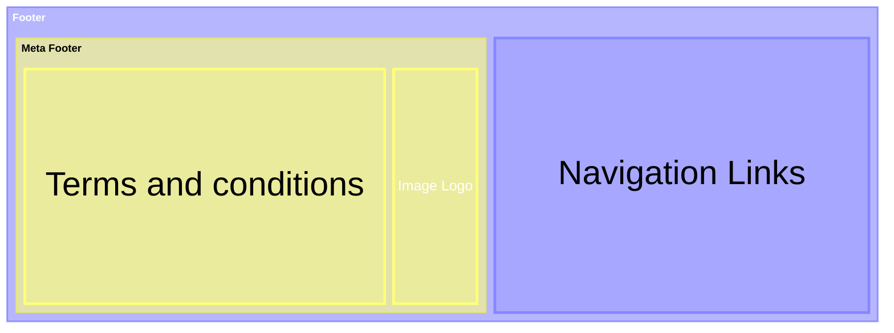

# Guidance for common elements across portals.

## Contents

Pages
Templates
Landmarks (Organisms )
Regions (Molecules)
Components (Atoms)


## Footer
For the footer, my first option was based on well-known public organizations and their commitment to a11y, so I got inspiration from the Government of Canada and the Government of UK.

Definition of elements inside the footer.
For the elements inside a footer, let's combine what we know with the resources we want to mimic, like the UK Government. For this particular case, we used Nielsen Norman Group guidelines, which outline what a common user looks for in a footer.
For example illumina include the following disclaimer:
> For Research Use Only, Not for use in diagnostic procedures (except as specifically noted).

<footer>
{{ contextual header }}
{{ contextual links }}
{{ images }}
{{ Your services links }} // links to your services: ‘Privacy’, ‘Accessibility’, ‘Cookies’ and ‘Terms and conditions’ for the link text.
{{ Secondary navigation }} // links out of your service
{{ meta information }}
</footer>

# What elements are mandatory and optional for us?
Only the meta information should be mandatory.

## The meta information is mandatory.
- Terms and conditions
- Image Logo

## Visual representation



## Specific to our case
### Contact and support links
- Help, questions and comments
- Privacy policy
- Accessibility statement
- Terms and conditions

### Navigation links
- Languages
- License
- Copyright

### Images
- Image Logo

## Authentication Components
Login / Sign In: Usually positioned in the top right header.
Register / Create Account: For new users.
Forgot Password / Account Recovery: A critical flow for users who lose access.
Multi-Factor Authentication (MFA): Secondary verification prompts (e.g., SMS, Authenticator apps).
Session Timeout Warning: A modal or banner that warns users before they are automatically logged out.
My Profile / Account Settings: The authenticated state that replaces the "Login" button.
Sign Out / Log Out.

## Header structure
For the header we can organize the elements in the following way:
<header>
{{ Image Logo link to home. }}
{{ Search bar. }}
{{ Menu options. }}
{{ Authentication components. }}
</header>

## Account creation and login experience
For the oauth page we can mimic a technology product. 
Integrate https://cilogon.org/example/ in the flow.

After Click in Log in:
<section> // inside main
  {{Header and welcoming message}}
  <form>
    {{ Enter your email }}
    {{ Sign up or sing in submit button }}
  </form>
  {{ List of sign up or sign in options  }} // passkey, Google, ...
  {{ By proceeding, you agree to the Terms of Service and Privacy Notice }}
</section>

After submit the form:
<section> // inside main
  {{Header and welcoming message}}
  <form>
    {{ your email }} // hidden field no editable
    {{ your pass }} // hidden field if required
    {{ Sign in submit button }}
  </form>
  {{ By proceeding, you agree to the Terms of Service and Privacy Notice }}
  {{ Use a different account link }}
  {{ Forgot password link  }} // only visible if user exist
</section>

If is a new user we confirm the email.


## Error pages
The error page will have a indirect error cause message followed by the http status code.

<main>
{{ Header with the Response status text group }} //  Page not found 
{{ Instructions to go back - Link}}
{{ response status code and specific text}}
{{ Report and feedback form}} // Is this page useful? Yes No [Report a problem Form ]
</main>

the form could be something like:
```
Help us improve [Name of service]

Do not include personal or financial information like your National Insurance number or credit card details.
What were you doing?
What went wrong?
```

## User profile/account controls
After login the header shows the user menu instead of the log in.
<accordion> // Hamburger button with two elements "My settings" and "Sign out"
{{  My settings  }}
{{  Sign out  }}
</accordion>

The settings page will have 2 sections: User Profile and security. And, the delete account link.


## Menu options
At the moment one element to change the language.

