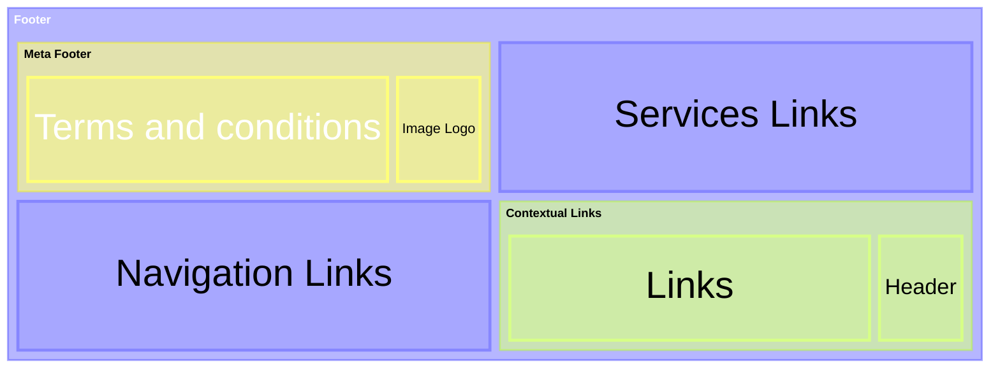
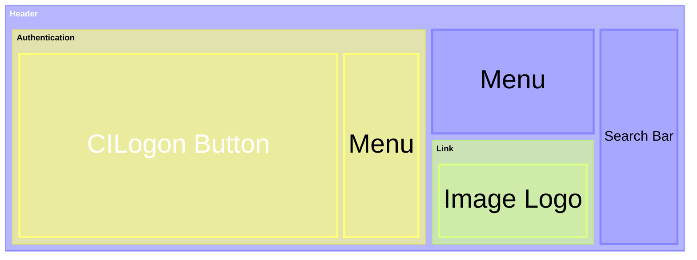
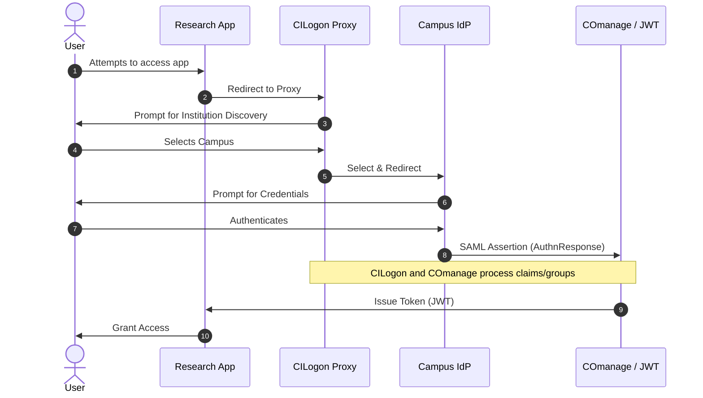

# Guide for common elements across portals.

We value contributions and feedback and want you to contribute effectively. To make your contribution experience as smooth as possible, [please reach out to us first][contrib].

### How to read this guide
Throughout this document, you will see HTML structures containing tokens like `{{ my_design_token }}`. This logicless syntax represents dynamic data.
- **For Designers:** These tokens represent the elements or text nodes that need to be accounted for in your designs.
- **For Developers:** Every token maps directly to a property in a corresponding `*.schema.json` file. These schemas dictate the strict data contract your React components must accept as props.

> [!WARNING] 
> **_Under construction labels_**
>
> Consider slowing down in the sections that contain the _Under construction_ symbols: 🚧 🏗️ 👷🏾‍♀️ 🦺 ⚠️
> This document will point out the work in progress using construction symbols.

At the moment, we face some challenges trying to standardize the design token language. The aim is to follow a standard so any app will be competent enough to translate the design tokens into code or visualizations. We have chosen JSON given its versatility in representing data.
 - [ ] [Modular schemas ⚠️ 🏗️](https://json-schema.org/understanding-json-schema/structuring) If in the future we have a CMS.


# Contents

- [Pages](#pages)
- [Templates](#templates)
  - [Footer](#footer-template)
  - [Header structure](#header-template)
  - [Error pages](#error-pages)
- [Landmarks (Organisms)](#landmarks-organisms)
  - [Header](#header)
  - [Footer](#footer)
  - [User profile/account controls](#account-settings)
  - [Menu options](#menu-options)
- [Regions (Molecules)](#regions-molecules)
  - [Authentication Components](#authentication-components)
- [Components (Atoms)](#components-atoms)
- [References](#references)

## Pages

- [ ] ⚠️ 🏗️ Terms and conditions
>[!TIP]
> For example, Canada includes the following:
> _[Terms and conditions](https://www.justice.gc.ca/eng/terms-avis/index.html#usa)_.
- [ ] ⚠️ 🏗️ Disclaimer
>[!TIP]
> For example, Illumina includes the following disclaimer:
> _For Research Use Only, Not for use in diagnostic procedures (except as specifically noted)_.
- [ ] ⚠️ 🏗️ Header
- [ ] ⚠️ 🏗️ Footer
- [ ] ⚠️ 🏗️ User settings
- [ ] ⚠️ 🏗️ Menu


## Templates

### Footer Template
[🔗 definition](#footer) 

**Visual representation**



**Specific to our case**

**_Contact and support links_**
- Help, questions and comments
- Privacy policy
- Accessibility statement
- Terms and conditions

**_Navigation links_**
- Languages
- License
- Copyright

**_Images_**
- Image Logo

**_Services_**
- Administration & Identity
- Data Submission System
- Research Portal
- Participant Portal
- SD4H Infrastructure


### Header Template
[🔗 definition](#header) 

**Visual representation**


### Login
**Login experience**
:
The user experience is provided by CILogon. For example:
> [!CAUTION]
> For the real specs visit the IAM documentation. 



After attempting to access the app, the user will be redirected to their institution. We cannot know exactly what the institution's login components look like, but they might be similar to the following example.
:

```
<section> // inside main
  {{Header and welcoming message}}
  <form>
    {{ Enter your email }}
    {{ Sign up or sign in submit button }}
  </form>
  {{ List of sign up or sign in options  }} // passkey, Google, Institution...
  {{ By proceeding, you agree to the Terms of Service and Privacy Notice }}
</section>
```

After submitting the form
:
```
<section> // inside main
  {{Header and welcoming message}}
  <form>
    {{ your email }} // hidden field no editable
    {{ your pass }} // hidden field if required
    {{ Sign in submit button }}
  </form>
  {{ By proceeding, you agree to the Terms of Service and Privacy Notice }}
  {{ Use a different account link }}
  {{ Forgot password link  }} // only visible if user exists
</section>
```
You should be forwarded to the PCGL app.

### Error pages
The error page will have an indirect error cause message followed by the HTTP status code.
```
<main>
{{ Header with the Response status text group }} //  Page not found 
{{ Instructions to go back - Link}}
{{ response status code and specific text}}
{{ Report and feedback form}} // Is this page useful? Yes No [Report a problem Form ]
</main>
```
The form could be something like:
```
Help us improve [Name of service]
Do not include personal or financial information like your National Insurance number or credit card details.
What were you doing?
What went wrong?
```

## Landmarks (Organisms)

### Header
For the header we can organize the elements in the following way:
```html
<header>
  {{ menu_options }}
  {{ image_logo }}
  {{ search_bar }}
  {{ authentication_components }}
</header>
```

> [!NOTE]
> _What elements are mandatory and optional for us?_
> 
> The [**authentication component**](#authentication-components) is a MUST.
> The rest of the elements are optional.


| Template Token | Schema Property | Description |
| --- | --- | --- |
| `{{ menu }}` | [`header.schema.json#/properties/render_menu`][header-schema] | List of navigation items for the main menu. |
| `{{ image_logo }}` | [`link.schema.json`][link-schema] | URL, alt text, and link for the portal's logo. |
| `{{ search_bar }}` | [`header.schema.json#/properties/render_search_bar`][header-schema] | Configuration for the search input component. |
| `{{ authentication_components }}` | [Authentication Components](#authentication-components) | Mandatory User profile, login, or settings controls. |

### Account Settings
<details>
<summary><b>🚧 Account settings (Work in Progress)</b></summary>

The settings page will have two sections: User Profile and Security, as well as a link to delete the account.
What information is available ? `voPerson` ?
This might not be relevant because the user technically will not have an account.
</details>

For the Account settings we can organize the elements in the following way:
```html
<main>
  <section>
    {{ user_profile }}
  </section>
  <section>
    {{ security }}
  </section>
  <section>
    {{ API_tokens }}
  </section>
  {{ delete_account }}
</main>
```

### Footer
Definition of elements inside the footer.

> [!NOTE]
> _What elements are mandatory and optional for us?_
>
> The **meta information** is a MUST.
> The rest of the elements are optional.

For the elements inside a footer, let's combine what we know with the resources we want to mimic, like the UK Government. For this particular case, we used Nielsen Norman Group guidelines, which outline what a common user looks for in a footer.

 - Contextual header and links
 - Secondary header and navigation items
 - Links to our services
 - Terms and conditions
 - Image Logo


Example:
```html
<footer>
  {{ contextual_header }}
  {{ contextual_links }}
  {{ images }}
  {{ secondary_navigation }}
  {{ services_links }}
  {{ meta_information }}
</footer>
```

| Design Token | Schema (Property) | Description |
| --- | --- | --- |
| `{{ contextual_header }}` | [`navigation.schema.json#/properties/renderTitle`][navigation-schema] | The title of the contextual area. |
| `{{ contextual_links }}` | [`navigation.schema.json#/properties/renderLinks`][navigation-schema] | Links providing context to the current page. |
| `{{ images }}` | [`avatar.schema.json`][avatar-schema] | Logos or visual elements displayed in the footer. |
| `{{ secondary_navigation }}` | [`navigation.schema.json`][navigation-schema] | Links leading out of the service or to secondary areas. |
| `{{ services_links }}` | [`navigation.schema.json`][navigation-schema] | Core service links like Privacy, Accessibility, Cookies, etc. |
| `{{ meta_information }}` | [`footer-meta-item.schema.json`][footer-meta-schema] | Mandatory copyright or meta details. |


## Regions (Molecules)
- [ ] 🚧 Contextual header and links
- [ ] 🚧 Secondary header and navigation items
- [ ] 🚧 API Tokens list

### Menu options
At the moment, there is one element to change the language.

### Authentication Components
**User profile/account controls**
Before logging in, we must show the **CILogon Identity Provider Button** in the header.
After logging in, the header shows the user menu instead of the **CILogon Identity Provider Button**.
```
<details> // Hamburger button with two elements "My settings" and "Sign out"
<summary>{{ user name }}</summary>
{{  My Settings  }}
{{  Log Out  }}
</details>
```

Definition of elements inside the authentication components.


> [!NOTE]
> _What elements are mandatory and optional for us?_
>
> The **CILogon Identity Provider Button** is a MUST.


**Login / Sign In / Sign Out / Log Out.**

The login experience is provided by the CILogon Identity Provider. For example, see https://cilogon.org/example/

<div action="#" method="post" style="display: flex; max-height:40px; background: #4B794B; max-width:90px">

<input type="image" name="cisubmit2" id="cisubmit2"
src="https://cilogon.org/images/cilogon-ci-32-g.png"
alt="CILogon Service"
title="Click to use the CILogon Service."
style="cursor:help;" />
</div> 


> [!TIP]
> CILogon has several [customization options][cilogon-config] which change the behavior and/or content of the CILogon website.

### My Profile / Account Settings
The authentication settings are managed by the identity provider organization.


 
## Components (Atoms)
- Text
- [Link][link-schema]
- Button

## References

### Design Guidelines
- [Nielsen Norman Group: Footers](https://www.nngroup.com/articles/footers/)
- [GOV.UK Design System](https://design-system.service.gov.uk/)

### Authentication (CILogon)
- [CILogon Device Setup][cilogon-device]
- [CILogon Skin Customization][cilogon-skin]
- [CILogon Configuration Example][cilogon-config]

### Internal Documentation
- [Contribution Guidelines][contrib]
- [Footer components][footer-data]
- [Footer schema][footer-schema]
- [Footer meta item schema][footer-meta-schema]
- [Navigation schema][navigation-schema]
- [Link schema][link-schema]
- [Avatar schema][avatar-schema]


[contrib]: patterns/docs/CONTRIBUTING.md
[cilogon-device]: https://www.cilogon.org/device
[cilogon-skin]: https://www.cilogon.org/skins#h.52ndu647pi2y
[cilogon-config]: https://cilogon.org/skin/config-example.xml
[footer-data]: ./pages/footer-data.json
[footer-schema]: ./organisms_landmarks/footer.schema.json
[footer-meta-schema]: ./molecules_regions/footer-meta-item.schema.json
[navigation-schema]: ./atoms_components/navigation.schema.json
[link-schema]: ./atoms_components/link.schema.json
[avatar-schema]: ./atoms_components/avatar.schema.json
[header-schema]: ./organisms_landmarks/header.schema.json
[menu_options]: ./#
[search_bar]: ./#
