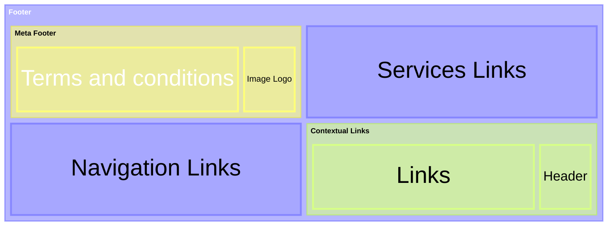
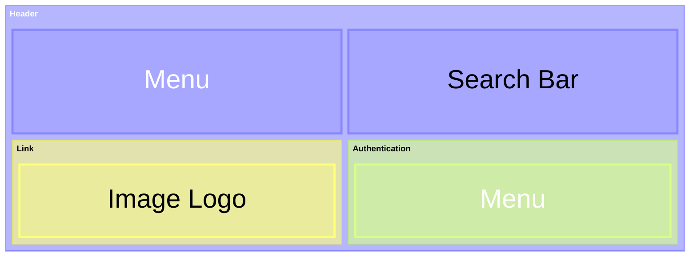
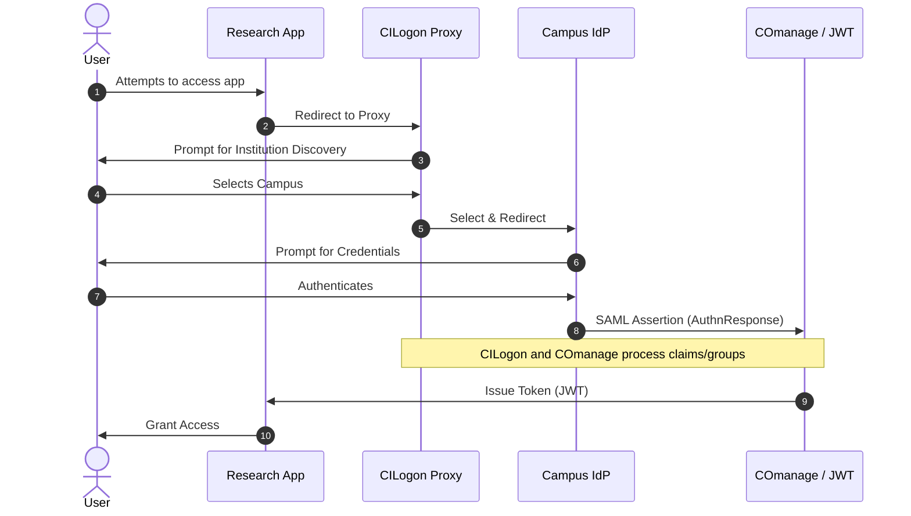

_Under construction_ 🏗️

# Guide for common elements across portals.

We value contributions and feedback and want you to contribute effectively. To make your contribution experience as smooth as possible, [please reach out to us first][contrib].

# Contents

- [Pages 📑](#pages-)
- [Templates](#templates)
  - [Footer](#footer)
  - [Header structure](#header-structure)
  - [Error pages](#error-pages)
- [Landmarks (Organisms)](#landmarks-organisms)
  - [User profile/account controls](#user-profileaccount-controls)
  - [Menu options](#menu-options)
- [Regions (Molecules)](#regions-molecules)
  - [Authentication Components](#authentication-components)
- [Components (Atoms)](#components-atoms)
- [References](#references)

## Pages 📑 

- [ ] Terms and conditions
>[!TIP]
> For example, Canada includes the following:
> _[Terms and conditions](https://www.justice.gc.ca/eng/terms-avis/index.html#usa)_.
- [ ] Disclaimer
>[!TIP]
> For example, Illumina includes the following disclaimer:
> _For Research Use Only, Not for use in diagnostic procedures (except as specifically noted)_.

## Templates

### Footer
Definition of elements inside the footer.

> [!NOTE] _What elements are mandatory and optional for us?_
>
> The **meta information** is mandatory.


For the elements inside a footer, let's combine what we know with the resources we want to mimic, like the UK Government. For this particular case, we used Nielsen Norman Group guidelines, which outline what a common user looks for in a footer.

 - Contextual header and links
 - Secondary header and navigation items
 - Links to our services
 - Terms and conditions
 - Image Logo


Example:
```
<footer>
{{ contextual header }}
{{ contextual links }}
{{ images }}
{{ Secondary navigation }} // links out of your service
{{ Your services links }} // links to your services: ‘Privacy’, ‘Accessibility’, ‘Cookies’ and ‘Terms and conditions’ for the link text.
{{ meta information }}
</footer>
```

Visual representation



Specific to our case
Contact and support links
- Help, questions and comments
- Privacy policy
- Accessibility statement
- Terms and conditions

Navigation links
- Languages
- License
- Copyright

Images
- Image Logo


### Header structure
For the header we can organize the elements in the following way:
```
<header>
{{ Menu options. }}
{{ Image Logo link to home. }}
{{ Search bar. }}
{{ Authentication components. }}
</header>
```

Visual representation



Login experience
:
The user experience is provided by CILogon, example:



After attempting to access the app, the user will be redirected to their institution. We cannot know exactly what the institution's login components look like, but they might be similar to the following example.
:

```
<section> // inside main
  {{Header and welcoming message}}
  <form>
    {{ Enter your email }}
    {{ Sign up or sign in submit button }}
  </form>
  {{ List of sign up or sign in options  }} // passkey, Google, Institution...
  {{ By proceeding, you agree to the Terms of Service and Privacy Notice }}
</section>
```

After submitting the form
:
```
<section> // inside main
  {{Header and welcoming message}}
  <form>
    {{ your email }} // hidden field no editable
    {{ your pass }} // hidden field if required
    {{ Sign in submit button }}
  </form>
  {{ By proceeding, you agree to the Terms of Service and Privacy Notice }}
  {{ Use a different account link }}
  {{ Forgot password link  }} // only visible if user exists
</section>
```

If it is a new user, we confirm their email address.


### Error pages
The error page will have an indirect error cause message followed by the HTTP status code.
```
<main>
{{ Header with the Response status text group }} //  Page not found 
{{ Instructions to go back - Link}}
{{ response status code and specific text}}
{{ Report and feedback form}} // Is this page useful? Yes No [Report a problem Form ]
</main>
```
the form could be something like:
```
Help us improve [Name of service]
Do not include personal or financial information like your National Insurance number or credit card details.
What were you doing?
What went wrong?
```

## Landmarks (Organisms)
### User profile/account controls
After logging in, the header shows the user menu instead of the login.
```
<accordion> // Hamburger button with two elements "My settings" and "Sign out"
{{  My settings  }}
{{  Sign out  }}
</accordion>
```

The settings page will have 2 sections: User Profile and security. And, the delete account link.


### Menu options
At the moment, there is one element to change the language.

## Regions (Molecules)
- Contextual header and links
- Secondary header and navigation items
- API Tokens list
### Authentication Components
Definition of elements inside the authentication components.


> [!NOTE] _What elements are mandatory and optional for us?_
>
> The **CILogon Identity Provider Button** is mandatory.


Login / Sign In / Sign Out / Log Out.
: The login experience is provided by the CILogon Identity Provider. For example, see https://cilogon.org/example/
:
<form action="#" method="post" style="display: flex; max-height:40px; background: #4B794B; max-width:90px">

<input type="image" name="cisubmit2" id="cisubmit2"
src="https://cilogon.org/images/cilogon-ci-32-g.png"
alt="CILogon Service"
title="Click to use the CILogon Service."
style="cursor:help;" />
</form> 


>[!TIP] CILogon has several [customization options][cilogon-config] which change the behavior and/or content of the CILogon website.

My Profile / Account Settings
: The authenticated state that replaces the "Login" button.
The authentication settings are managed by the identity provider organization, for example:

 
## Components (Atoms)
- Headers
- Text
- Link
- Button

## References

[contrib]: patterns/docs/CONTRIBUTING.md.
[cilogon-device]: https://www.cilogon.org/device
[cilogon-skin]: https://www.cilogon.org/skins#h.52ndu647pi2y
[cilogon-config]: https://cilogon.org/skin/config-example.xml